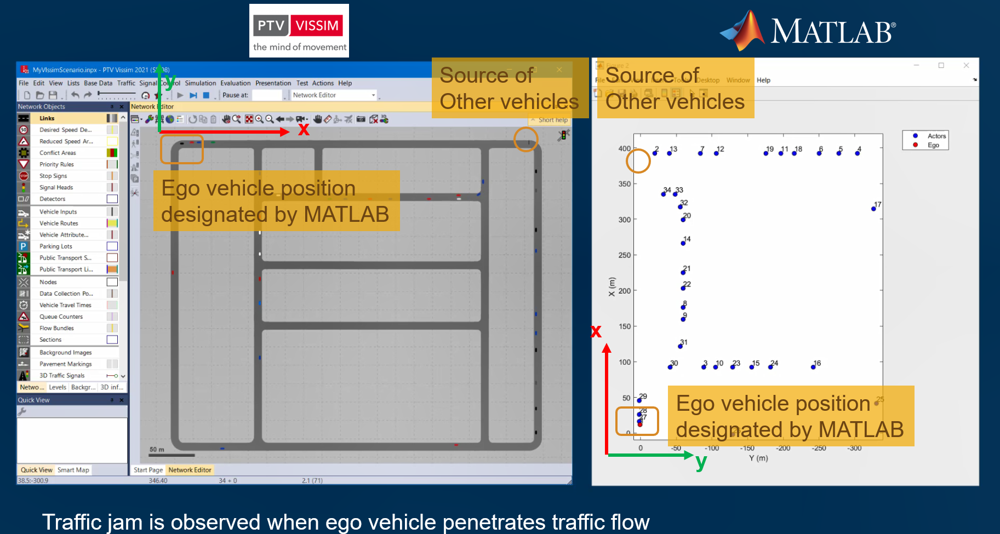
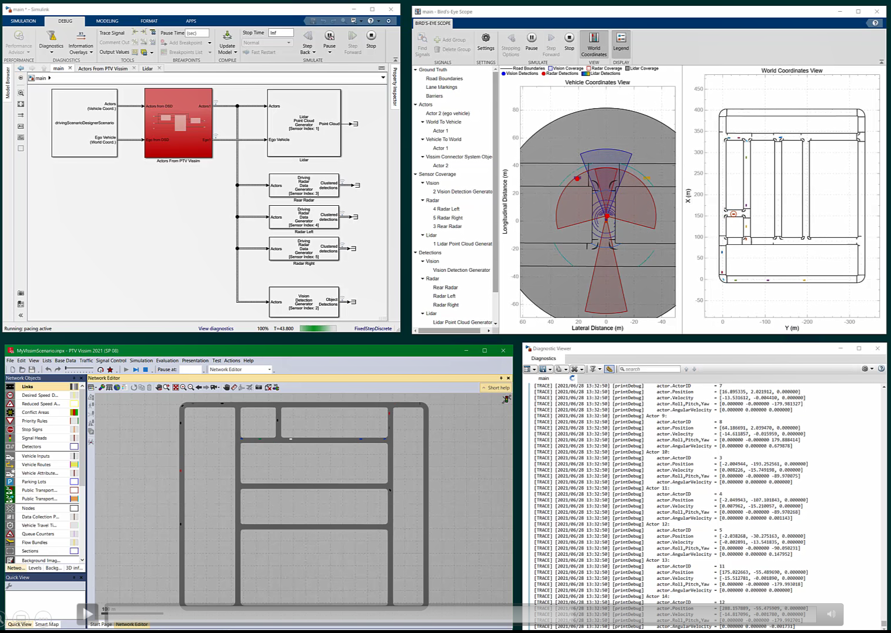
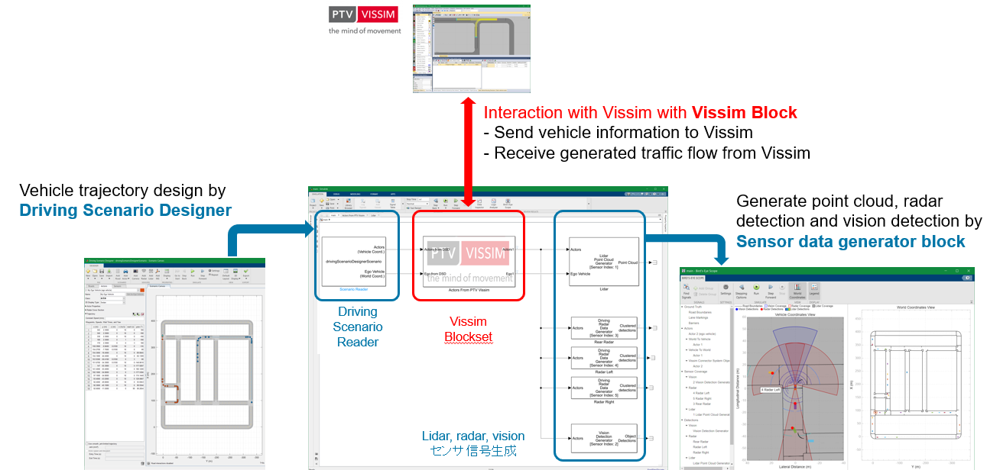
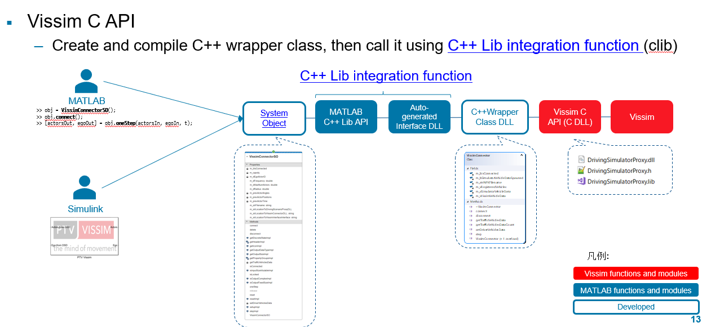

# Vissim Connector

[[_TOC_]]

## Overview

Vissim Connector is a prototype to collaborate with PTV Vissim from MATLAB and Simulink. 

See [PPT document in ./doc](./doc/20210628-PTV-VISSIM-integration.pptx) for detail.

## Screenshots

## Architecture

**Vissim Connector** performs following iteration for every simulation ticks:
- Vissim Connector System Object reads ego and other vehicle information stored in Simulink Bus or struct. 
- Then Visssim Connector sends information to Vissim to interact with Vissim's traffic simulation. 
- After Vissim returns all vehicle information, Vissim Connector identifies which vehicles are ego and other traffics, then return information.

**Vissim Connector** utilizes Vissim C API. We create:
- A C++ Wrapper Class DLL connecting Vissim C API and [C++ Library integration function](https://www.mathworks.com/help/matlab/call-cpp-library-functions.html) in MATLAB
- A System Object (Vissim Connector) allowing user to interact with Vissim through MATLAB or Simulink.

## How to use

### Run from MATLAB (mainWithSO.m) (for debug)
1. Open `./VissimConnector.prj.`
2. Run `./test/mainWithSO.m` to see how Vissim and MATLAB interacts traffic data.

### Run from Simulink with project (main.slx) (for debug)
1. Open `./VissimConnector.prj.`
2. Open `./test/main.slx.`
3. Run the Simulink simulation.
   - Note: Bird's-eye view allows to monitor how sensor detects vehicles spawned by Vissim.

### Run from Simulink with installed Vissim Blockset (mainWithToolbox.slx) (Recommended)
1. Install Vissim Blockset. Refer to [guidance below](#how-to-install) 
2. Open `./test/mainWithToolbox.slx` (You don't have to open project file `./VissimConnector.prj.`)
3. Run the Simulink simulation.

## How to build

### Building C++ wrapper class DLL

1. Open `./VissimConnectorDLL/VissimConnectorDLL.sln` with Visual Studio 2019.
2. Build solution and you will find C++ wrapper class DLL `VissimConnectorDLL.dll` (dynamic link library) and `VissimConnectorDLL.lib` (DLL import library, not static library) in `./VissimConnectorDLL/x64/Release.`

### Building auto-generated interface DLL

1. Open MATLAB project file `./VissimConnector.prj`.
2. Run `./VissimInterfaceBuild/generateCPPInterface.m` step by step to build and finally you will find auto-generated interface DLL `VissimInterfaceInterface.dll` in `./VissimInterface.`

### Building Vissim Blockset (Simulink Library)
1. (Manual Operation) Create Simulink Library `VissimConnectorLib.slx` from VissimConnector.slx, by copy and paste PTV Vissim Connector block from `VissimConnector.slx` to `VissimConnectorLib.slx.`
2. Run `buildtools/setSLLibSettings.m` to mark the library searchable from Library Browser.
3. Run `buildtools/copyFilesToBuildDir.m` to gather necessary files into build folder `build.`
4. Open `buildtools/Vissim Blockset.prj`.
5. Click PACKAGE tab > PACKAGE section > Package to make package. `buildtools/Vissim Blockset.mltbx` is generated.

## How to install Vissim Blockset
1. Launch MATLAB and Open `./distrib/Vissim Blockset N.N.mltbx` from MATLAB to install, where N.N represents version of the Blockset. 
Toolbox will be automatically installed to `C:\Users\Username\AppData\Roaming\MathWorks\MATLAB Add-Ons\Toolboxes.`

## Prerequisites
Tested with following environment:
- Windows 10 21H1
- MATLAB R2021a update 4
  - MATLAB
  - Simulink
  - Automated Driving Toolbox 
- PTV Vissim 2021
  - Note: API change is expected for every major update of Vissim.
- Visual Studio 2019 (if you want build C++ wrapper class DLL)

## Developer Notes

### To Do:
- p-code
- Support more Vissim parameters through mask parameter setting.
- Log level setting through mask parameter setting.

### Directories

- `.git` : git dir
- `build` : working dir to build Simulink Library
- `buildtools` : utility scripts to build Simulink Library. See [How to build](#how-to-build) for detail.
- `data` : sample OpenDrive data (xodr,) Driving Scenario Designer session file (.mat) and Vissim scenario file (.inpx.)
- `distrib` : distributable toolbox package (.mltbx)
- `doc` : documents (*.ppt) and images for this README.md (*.png.)
- `resources` : MATLAB project files
- `test` : test script (*.m) and Simulink model (*.slx) working with sample data. See [How to use](#how-to-use) for detail.
- `VissimConnector` : MATLAB system object class (*.m,) Simulink model (*.slx) and companion scripts (*.m.)
- `VissimConnectorDLL` : a C++ Wrapper class DLL connecting MATLAB auto-generated interface DLL and and Vissim C API (Driving Simulator API.)
- `VissimInterface` : auto-generated interface DLL generated by scripts in VissimInterfaceBuild, connecting MATLAB C++ API and C++ Wrapper class DLL.
- `VissimInterfaceBuild` : script for building auto-generating bridge DLL.
- `README.md` : this file.
- `VisssimConnector.prj` : MATLAB project file.